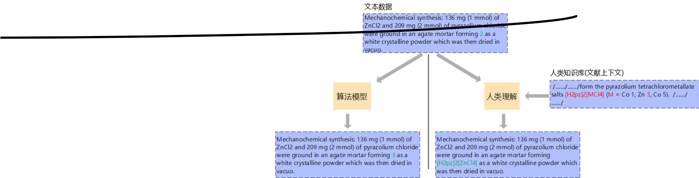

文本分类，基于pytorch，

大模型训练难点，一是数据规模和数据质量，二是预训练任务的设计。本项目参考现有技术，从数据和任务两个方面提高模型性能，提出一个高质量知识补充任务来提高数据质量，同时设计一个无监督的代理任务让模型微调处于一个更好的起点

##动机

## 环境
python 3.9，
pytorch 1.10.1，  
tqdm，  
sklearn，  
optuna，
transformers，
ast，
regex

## 数据集
本文从各期刊出版社中批量货期了2万余科学文献，切分成段落，按是否含合成信息进行手工标注，数据集已上传至github，文本长度在50到3900token之间，中位数为334。一共2个类别，类别间比例为1：9。
final_dataset是最初的数据集，dataset_v2是高质量知识补充后的数据集

## 预训练模型：
bert-base、sentence-bert、deberta-v3和matscibert、chembert、scibert

## 超参数设置：
学习率	1.5e-5/5e-5
批次大小	32
迭代次数	5
学习率预热(Warm up)	0.1
最大输入序列长度	350

## 效果

模型|macro-f1|lightmlp的效果比cnn，rnn，dpcnn等好
训练过程中发现增加高质量知识补充任务的模型收敛所需迭代次数减少一半
